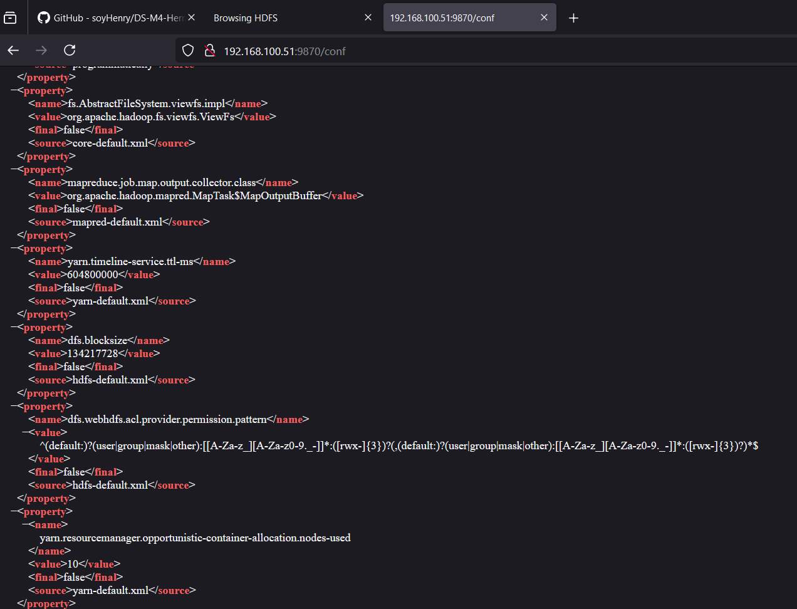
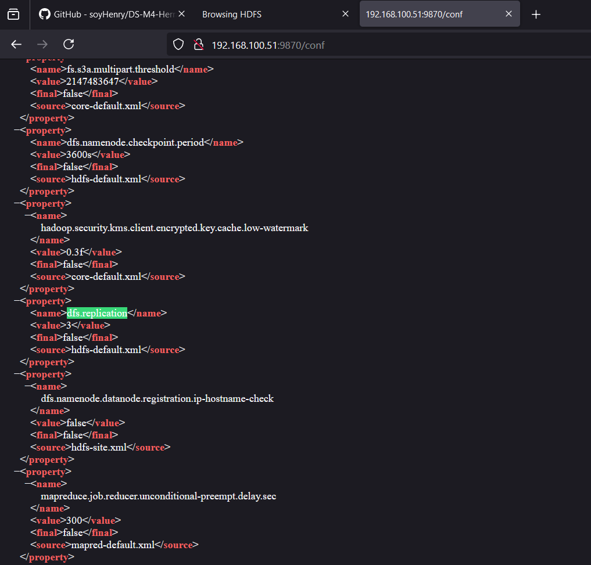
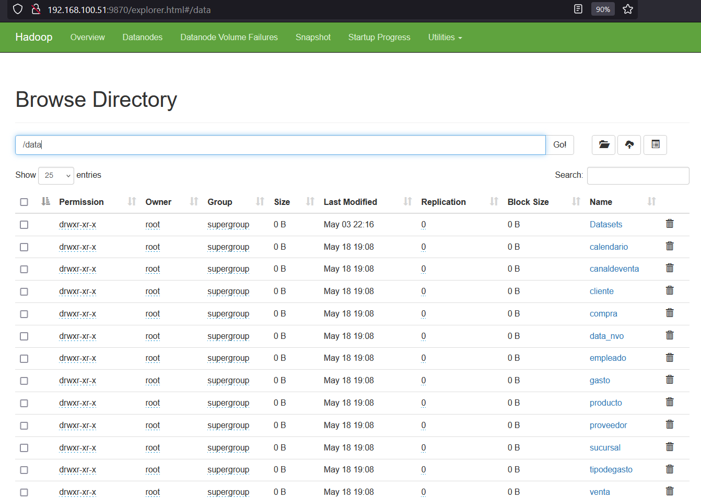
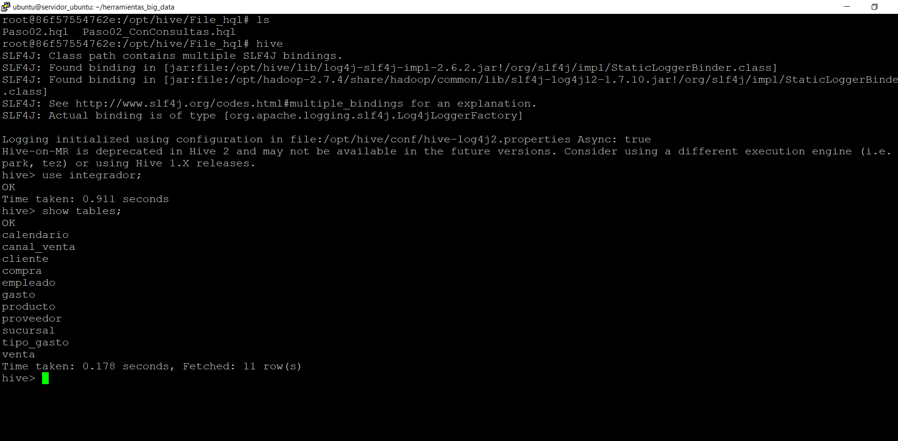
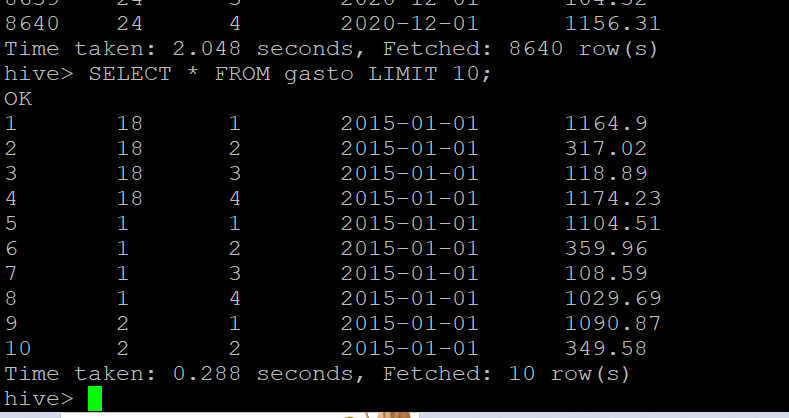
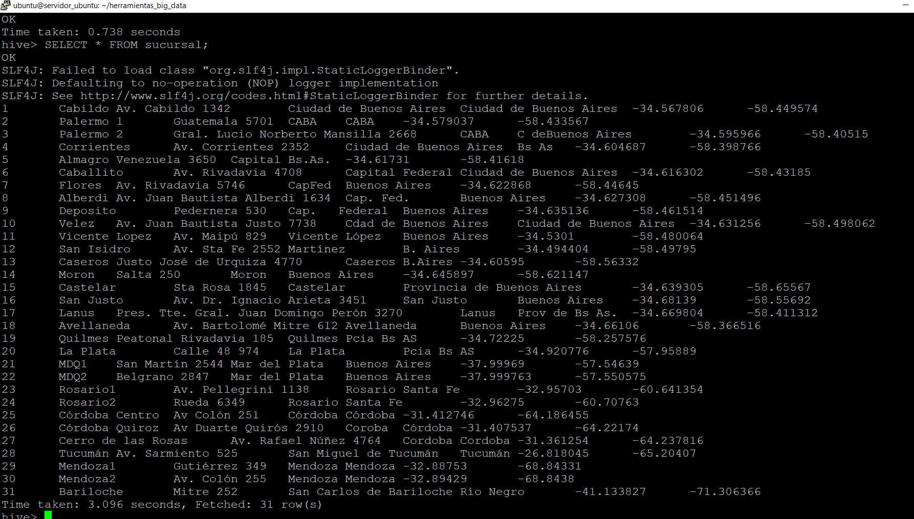

# Trabajo Integrador

**Alumno**: Adrian Lazzarini  
**Curso**: DATA 09 PT  
**Fecha**: 19/05/2024  

## Créditos

Quiero dar créditos a Franco Cavo y Juan Diego Fernandez Camacho quienes me colaboraron para la realización de este trabajo integrador.

## Guía de Pasos

Dejo aquí una guía en pocos pasos a modo de ejemplo de lo que tuve que hacer para el trabajo integrador. Llegué hasta el punto 5.

### Levantar un Contenedor

```
sudo docker-compose -f docker-compose-vX.yml up -d
```

### Ejecutar Contenedor de Manera Interactiva
```
sudo docker exec -it namenode bash

sudo docker exec -it hive-server bash
```
### Copiar los Archivos de la Máquina Virtual al Contenedor

Ejemplo:
```
sudo docker cp hive_scripts/Paso02.hql hive-server:/home/Paso02.hql
```
### Ejecutar los Archivos .sh o .hql Según el Punto Requerido
```
sudo docker exec -it hive-server bash
hive -f Paso004.hql
```
### HBase
```
sudo docker exec -it hbase-master hbase bin/bash  # entro al contenedor
hbase shell  # para entrar a la terminal de HBase
```
## Nota
Busqué dfs.blocksize y dfs.replication en http://<IP_Anfitrion>:9870/conf para encontrar los valores de tamaño de bloque y factor de réplica respectivamente, entre otras configuraciones del sistema Hadoop.







## Haciendo consultas de datos cargados en Hive:








